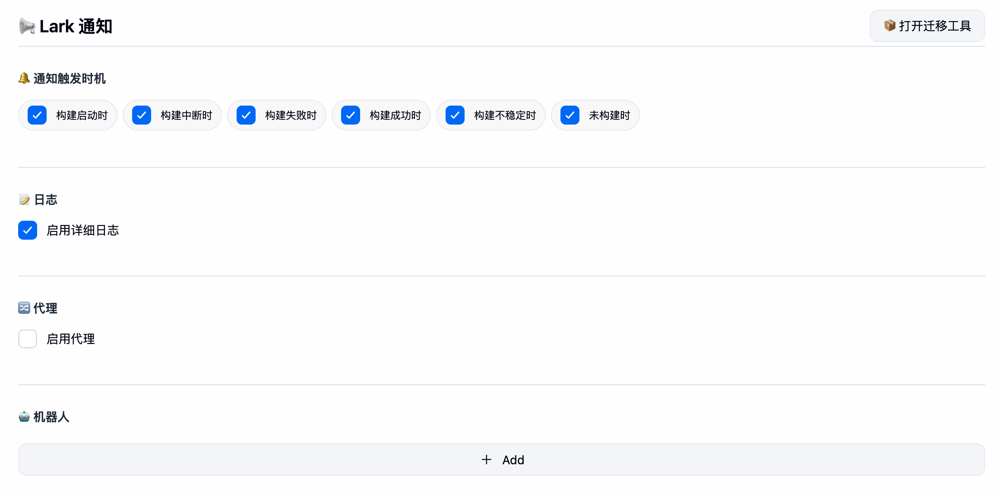
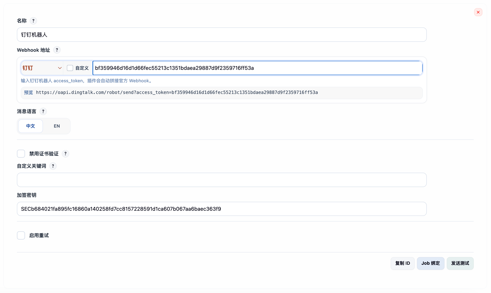

# 常见问题

### 1. 如何获取图片资源

可通过 `消息卡片搭建平台` 上传图片。应用可选择 `开发者小助手` 或 `Open Platform Assistant`，上传完成后可获得图片资源 `Key`。

- [飞书消息卡片搭建平台](https://open.feishu.cn/cardkit)
- [Lark 消息卡片搭建平台](https://open.larksuite.com/cardkit)


> [!NOTE]
> 这一方式主要适用于 `Lark / 飞书` 图片消息或卡片图片资源。企业微信卡片图片更适合直接使用外部可访问的图片 URL。

### 2. 无法正常加载图片

1. 检查当前平台的图片能力是否匹配。

   - `Lark / 飞书` 的 `IMAGE` 消息和卡片图片通常需要使用平台图片资源 `Key`，不能直接把外部图片 URL 当作图片消息资源。
   - `企业微信` 卡片图片需要使用可直接访问的 `http/https` 图片 URL。

2. 检查图片资源 `Key` 是否与机器人所属平台一致。`飞书` 与 `Lark` 平台的图片资源 `Key` 不能混用。

### 3. 无法发送消息通知

**情况一：安装插件后未重启 Jenkins**  
安装插件后，请先重启 Jenkins，再进行通知测试。

**情况二：没有勾选通知时机**  
请在配置页面勾选对应的 `通知时机`，然后重新启动 Jenkins。


**情况三：没有正确配置安全策略**  
请检查目标平台是否已启用签名校验、关键词校验或 IP 白名单等安全限制。如果已启用，请在机器人配置中正确填写 `加密密钥`、关键词或调整 Jenkins 出口网络。


**情况四：Webhook 平台类型选错了**  
如果把企业微信 Webhook 配成飞书/Lark，或者把钉钉 Token 当作企业微信 Key 使用，测试消息通常会直接失败。请重新进入机器人编辑器，确认：

- 平台选择器与实际机器人平台一致
- 预览区中的最终 Webhook 地址符合目标平台格式
- 自定义模式下粘贴的是完整可用的 Webhook 地址

**情况五：企业微信消息类型超出平台能力**  
企业微信不支持飞书那类 `IMAGE`、`SHARE_CHAT` 或完整 `POST` 富文本结构。建议优先使用 `TEXT`、`MARKDOWN` 或插件内置 `CARD`。

### 4. 点击消息按钮无法正常跳转

**情况一：未配置 Jenkins Location URL**

打开 `Manage Jenkins` -> `Configure System`，找到 `Jenkins Location` 配置项，填写 `Jenkins URL` 后重启 Jenkins。

### 5. Jenkins 停止 / 重启 / 重载

```shell
# 格式：https://[jenkins-server-address][:port]/[command]
 
# 退出
https://[jenkins-server-address][:port]/exit
 
# 重启
https://[jenkins-server-address][:port]/restart
 
# 重载
https://[jenkins-server-address][:port]/reload
```
